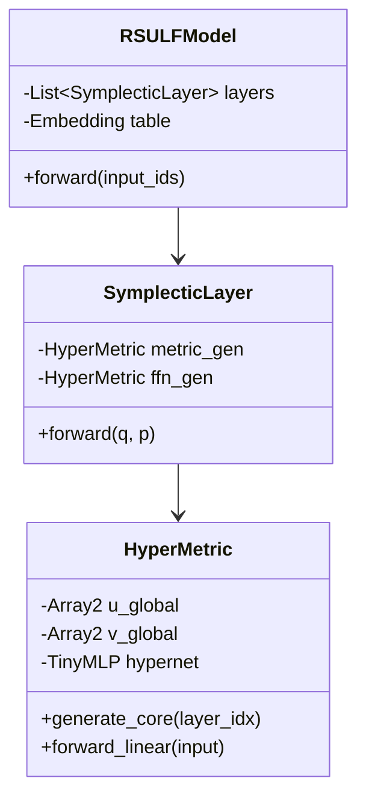

# 4장. 구현 아키텍처 및 데이터 흐름 (Implementation Blueprint)

## 1. 시스템 아키텍처 개요 (System Architecture)

Reality Stone v2는 **함수형 다양체 압축(Functional Manifold Compression)** 이론을 기반으로 한 차세대 추론 엔진이다.
기존의 "레이어별 행렬 저장" 방식을 폐기하고, **"전역 기저 + 하이퍼네트워크"** 구조를 도입하여 메모리 사용량을 극단적으로 줄이면서도 FP16 정밀도를 유지한다.

### 1.1 핵심 컴포넌트
1.  **HyperMetric Engine**: 모델의 가중치를 생성하는 생성형 엔진.
    *   `GlobalBasis ($U, V$)`: $d_{model} \times r$ 크기의 공유 기저 행렬.
    *   `HyperNet ($\phi_\theta$)`: 레이어 인덱스를 입력받아 코어 텐서를 출력하는 초소형 MLP.
2.  **Symplectic Runtime**: 생성된 가중치를 이용해 추론을 수행하는 동역학 엔진.
    *   상태를 $(q, p)$ 위상 공간으로 관리.
    *   Symplectic Euler 적분기를 통해 수치적 안정성 확보.

---

## 2. 변환 파이프라인 (Compression Pipeline)

HuggingFace 모델을 RS-ULF v2 포맷으로 변환하는 3단계 프로세스이다.

### 2.1 Phase 1: Manifold Learning (기하학적 구조 학습)
모든 레이어의 가중치를 하나의 데이터셋으로 보고, 숨겨진 다양체 구조를 학습한다.

*   **Data Preparation**:
    *   $L$개 레이어의 $W_Q, W_K, W_V, W_{FFN}$을 모두 수집하여 텐서 $\mathcal{W}$ 구성.
*   **Global Basis Extraction**:
    *   텐서 $\mathcal{W}$에 대해 Randomized SVD를 수행하여 상위 $r$개의 주성분 벡터 $U_{global}, V_{global}$을 추출.
    *   이 기저들은 모델 전체의 "공통 어휘" 역할을 한다.

### 2.2 Phase 2: Functional Fitting (함수 근사)
추출된 기저 위에서의 좌표(Coefficient) 변화를 신경망으로 근사한다.

*   **Target Generation**:
    *   각 레이어 $l$에 대해, 기저로 투영한 코어 행렬 $C^{(l)}_{target} = U^\top W^{(l)} V$를 계산.
*   **Hypernetwork Training**:
    *   입력: 레이어 인덱스 $l$ (Normalized to $[0, 1]$) 또는 레이어 임베딩.
    *   모델: `TinyMLP` (Hidden: 64~128, Depth: 2~3).
    *   Loss: $\| \phi_\theta(l) - C^{(l)}_{target} \|_F^2$.
    *   이 단계는 매우 빠르게 수렴한다.

### 2.3 Phase 3: Symplectic Finetuning (동역학 미세조정)
구조적 압축으로 인한 기능적 손실을 보정한다.

*   **Teacher-Student Learning**:
    *   Teacher: 원본 FP16 모델.
    *   Student: `HyperMetric` + `SymplecticLayer`로 구성된 압축 모델.
*   **Optimization**:
    *   Global Basis $U, V$와 HyperNet $\phi_\theta$를 동시에 미세 조정(Joint Optimization).
    *   목표: 원본 모델의 Logits 출력 분포(KL Divergence) 및 Hidden States 궤적(MSE) 최소화.

---

## 3. 런타임 커널 설계 (Runtime Kernels)

### 3.1 `HyperMetric` 커널 (Weight Generation)
가중치 행렬을 메모리에 절대 복원하지 않는다(No Materialization). 연산 직전에 필요한 부분만 생성하거나, 커널 내에서 융합(Fusion)한다.

*   **Lazy Computation**:
    $$ y = x W \approx x (U \cdot C^{(l)} \cdot V^\top) = ((x U) \cdot C^{(l)}) \cdot V^\top $$
    *   행렬 곱 순서를 최적화하여 연산량을 $O(d^2)$에서 $O(dr + r^2)$로 감소시킴.
    *   $r \ll d$이므로 (예: $d=4096, r=64$), 이론상 약 30~60배 가속 가능.

### 3.2 `SymplecticLayer` 커널 (Dynamics Update)
*   **State Management**:
    *   입력 $x$를 위치 $q$로 매핑. 운동량 $p$는 0 또는 이전 스텝의 잔여량으로 초기화.
*   **Flow**:
    1.  **Momentum Kick (FFN)**: $p \leftarrow p + \text{FFN}(q)$
        *   여기서 FFN 가중치도 HyperMetric으로 실시간 생성.
    2.  **Position Drift (Attention)**: $q \leftarrow q + \text{Attn}(q, p)$
        *   Attention 가중치도 HyperMetric으로 생성.
    3.  **Output**: $q$를 다음 레이어의 입력으로 전달.

---

## 4. 파일 포맷 (.rsu v2)

Legacy 포맷을 폐기하고, 함수형 압축에 최적화된 새 포맷을 정의한다.

```
[Header]
Magic: "RSULF2"
Version: 2.0
Model_Type: "GPT2"
D_Model: 768
Basis_Rank: 64
Num_Layers: 12

[Global Basis]
// 모든 레이어가 공유하는 기저 행렬
// Size: d_model * rank * 2 (U, V) * sizeof(fp16)
Basis_U: [Binary Blob]
Basis_V: [Binary Blob]

[Hypernetwork]
// 레이어별 코어를 생성하는 MLP 파라미터
// Size: 매우 작음 (< 1MB)
Weights: [Binary Blob]
Biases: [Binary Blob]
Layer_Embeddings: [Binary Blob]
```

### 메모리 효율성 (GPT-2 Small 기준 예측)
*   **Original**: ~500MB
*   **RS-ULF v2**:
    *   Basis: $2 \times 768 \times 64 \times 2$ bytes $\approx 196$ KB
    *   HyperNet: $\approx 50$ KB
    *   **Total**: **< 1MB** (압축률 1/500 달성 가능)
    *   이론적 한계치에 근접한 압축률.

---

## 5. 클래스 다이어그램 (Class Structure)



