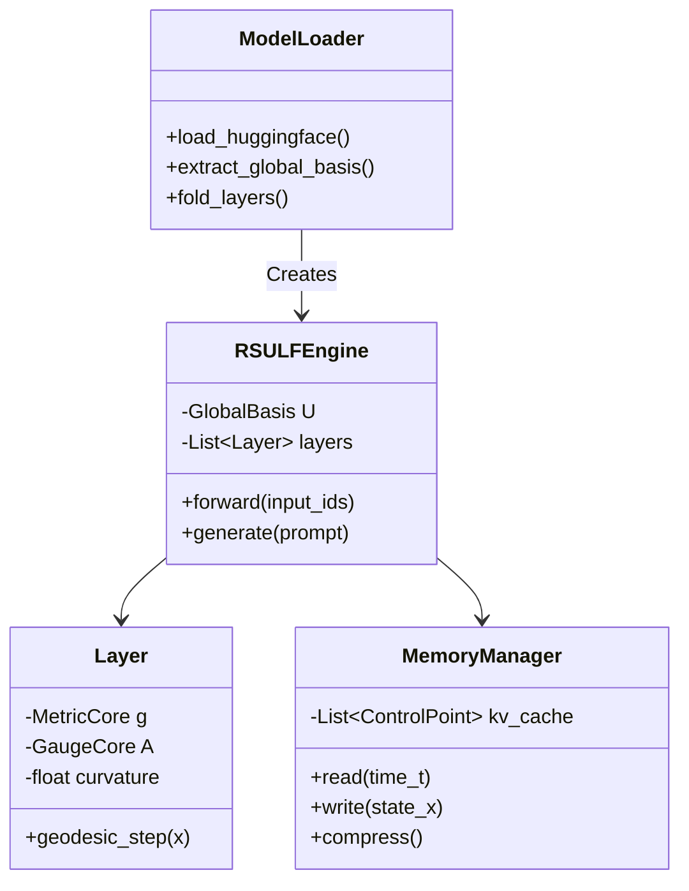

# 4장. 구현 아키텍처 및 데이터 흐름 (Implementation Blueprint)

## 1. 시스템 아키텍처 개요

본 장에서는 이론과 복잡도 분석을 바탕으로, 실제 작동하는 **지오데식 압축 추론 엔진(Geodesic Inference Engine)**의 소프트웨어 아키텍처를 설계한다. 시스템은 크게 **변환기(Converter)**, **런타임 커널(Runtime Kernels)**, **메모리 관리자(Memory Manager)**로 구성된다.

## 2. 변환 파이프라인 (Converter Pipeline)

HuggingFace 등의 표준 포맷 모델을 RS-ULF 포맷으로 변환하는 오프라인 프로세스다.

### 2.0 레이어 스펙트럼 분석 및 폴딩 차원 설계

변환 파이프라인의 가장 앞 단계에서, 각 레이어의 스펙트럼 구조를 먼저 분석하고 전역 폴딩 차원 $R$을 설계한다. 이 단계는 이후 `Global Basis U` 추출과 레이어별 폴딩이 어떤 랭크로 수행될지를 결정하는 정책 계층이다.

**입력**
- 트랜스포머 레이어별 가중치 $W_Q^{(l)}, W_K^{(l)}$

**출력**
- `RankPlan` (전역/그룹별 폴딩 랭크 정책)
- `AnalyzerStats` (레이어별 스펙트럼 통계)

#### 2.0.1 Spectrum Analyzer

각 레이어의 어텐션 구조를 스펙트럼 관점에서 요약한다.

1. 레이어 $l$에 대해 $B_l = W_Q^{(l)\top} W_K^{(l)}$를 계산한다.
2. $B_l$에 대해 상위 $k$개의 특이값/고유값을 근사한다. (대형 모델에서는 랜덤라이즈드 SVD/부분 SVD 사용)
3. 누적 에너지 비율 기준 랭크를 계산한다.
   - $r_{95}^{(l)}$: 상위 $r$개 특이값으로 전체 에너지의 95%를 설명하는 최소 랭크
   - $r_{99}^{(l)}$: 99% 기준 최소 랭크
4. 스펙트럼 꼬리 에너지(버려지는 영역)를 기록한다.
   - $\text{TailEnergy}^{(l)}(r) = \sum_{i>r} \sigma_i^{(l)}$

Analyzer는 다음과 같은 통계를 전 레이어에 대해 축적한다.
- 레이어별 $\{r_{95}^{(l)}, r_{99}^{(l)}\}$ 분포
- 레이어별 TailEnergy 곡선

#### 2.0.2 Rank Planner

Spectrum Analyzer 출력에 기반해, 실제 폴딩에 사용할 전역 랭크와 (필요시) 영역별 랭크를 결정한다.

1. 모든 레이어의 $r_{95}^{(l)}$, $r_{99}^{(l)}$ 분포를 집계한다.
2. 안전 마진을 고려해 전역 폴딩 랭크 $R_{\text{max}}$를 선택한다.
   - 예: $R_{\text{candidate}} = \max_l r_{95}^{(l)}$
   - 하드웨어 친화적인 값으로 스냅: $R_{\text{max}} = \text{round\_up\_to\_multiple}(R_{\text{candidate}}, 32)$
   - 상한을 두어 과도한 랭크를 방지: 예) $R_{\text{max}} \le 128$
3. 필요하다면 레이어를 구간별 그룹으로 나눈다.
   - 예: `shallow`, `middle`, `deep` 그룹별로 $\{r_{95}, r_{99}\}$ 통계를 따로 집계하여, 그룹별 유효 랭크 $R_{\text{shallow}}, R_{\text{mid}}, R_{\text{deep}}$을 정의한다.
4. 최종적으로 `RankPlan` 구조를 생성한다.
   - `global_rank`: $R_{\text{max}}$
   - `layer_groups`: (선택) 각 그룹 이름, 레이어 인덱스 범위, 그룹별 유효 랭크

이 단계의 핵심은 **실제 변환 전에 “몇 차원으로 접을 것인지”를 전역 정책으로 고정**하는 것이다. 이후 `Global Basis U` 추출과 레이어별 폴딩, `.rsu` 패킹은 이 `RankPlan`을 기준으로 수행된다.

### 2.1 데이터 흐름
1.  **Loader**: `.safetensors` 등에서 $W_Q, W_K, W_{FFN}$ 로드.
2.  **Analyzer**: 전체 레이어 스캔 $\to$ 메트릭 통계 수집 $\to$ Global Basis ($U$) 추출.
3.  **Folder**: 각 레이어 가중치를 $U$에 투영 $\to$ Core Matrix ($g_{core}, A_{core}$) 및 곡률($\kappa$) 산출.
4.  **Distiller**: FFN을 포텐셜 함수로 근사 최적화 (SGD 수행).
5.  **Packer**: 압축된 파라미터를 전용 바이너리 포맷(`.rsu`)으로 저장.

### 2.2 파일 포맷 (.rsu)
```
[Header]
Magic: "RSULF"
Version: 1.0
D_model: 4096
Rank: 128
Layers: 32

[Global Shared]
Basis_U: [4096, 128] float16

[Layer 0]
Metric_Core: [128, 128] float16
Gauge_Core: [128, 128] float16
Curvature: float32
Potential_Params: [Bytes]

...
```

## 3. 런타임 커널 설계 (Runtime Kernels)

GPU 상에서 고속으로 실행되는 핵심 연산 커널이다. (CUDA/Triton 기반)

### 3.1 `FusedGeodesicStep` Kernel
메모리 입출력을 최소화하기 위해 여러 연산을 하나의 커널로 융합한다.

*   **Input**: 상태 $x$, 메트릭 코어 $g_{core}$, 곡률 $\kappa$, 그래프 인접정보.
*   **Logic**:
    1.  (Register) $x$ 로드.
    2.  (SRAM) $U$와 $g_{core}$를 이용해 로컬 메트릭 효과 계산.
    3.  (Compute) 포텐셜 그라디언트 $-\nabla \Phi$ 계산.
    4.  (Compute) 그래프 확산항 $\beta L x$ 계산.
    5.  (Compute) 지수 맵 $\text{Exp}_x(v)$ 근사 계산 (Retraction).
    6.  (Register) $x_{next}$ 업데이트.
*   **Output**: $x_{next}$.

### 3.2 `SplineReconstructor` Kernel
KV 캐시(제어점)로부터 현재 필요한 상태를 복원한다.

*   **Input**: 제어점 $x_{t_k}, v_{t_k}$, 타겟 시간 $t$.
*   **Logic**:
    1.  $t$가 속한 구간 $[t_k, t_{k+1}]$ 탐색.
    2.  리만 3차 스플라인 보간 수식 적용.
    3.  곡률 $\kappa$를 반영하여 경로 수정.
*   **Output**: $x(t)$.

## 4. 메모리 계층 구조 (Memory Hierarchy)

대역폭 효율성을 극대화하기 위한 메모리 배치 전략이다.

1.  **L1 Cache / Registers**:
    *   현재 처리 중인 토큰 상태 $x$.
    *   레이어별 Core Matrix ($128 \times 128$로 매우 작음 $\to$ 레지스터 상주 가능).
2.  **L2 Cache / Shared Memory**:
    *   Global Basis $U$ (모든 레이어가 공유하므로 L2 히트율 높음).
    *   로컬 윈도우의 그래프 구조.
3.  **HBM (Global Memory)**:
    *   압축된 KV 캐시 (제어점 리스트).
    *   DP 메모리 $V_t$.

## 5. 클래스 다이어그램 (Python/Rust Interface)



## 6. 결론

이 설계는 이론적으로 도출된 $O(N)$ 시간 복잡도와 압축된 메모리 구조를 하드웨어 레벨에서 실현하기 위한 구체적인 청사진이다. Global Basis의 공유 특성을 이용한 캐시 최적화와 Fused Kernel이 성능의 핵심이다.

